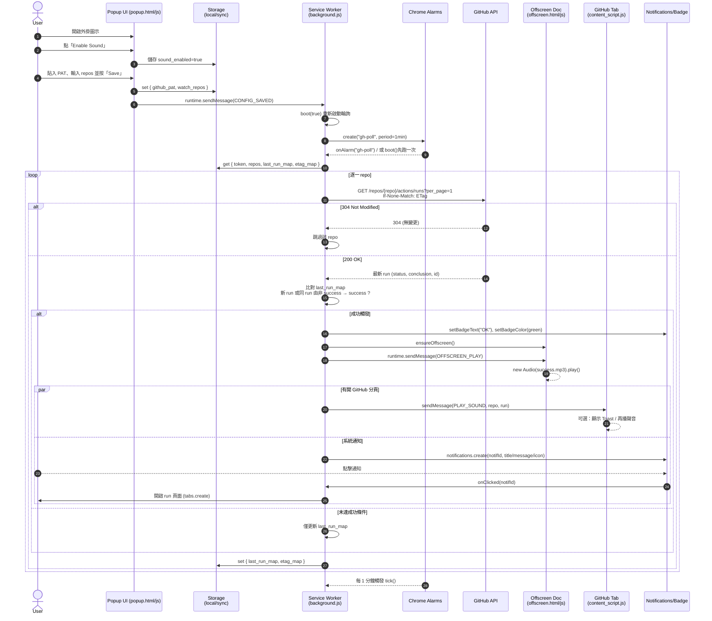

# Google Extensions 
> When git push to github play music

```mermaid
sequenceDiagram
    autonumber
    actor U as User
    participant P as Popup UI (popup.html/js)
    participant S as Storage<br/>(local/sync)
    participant SW as Service Worker<br/>(background.js)
    participant A as Chrome Alarms
    participant GH as GitHub API
    participant OS as Offscreen Doc<br/>(offscreen.html/js)
    participant CS as GitHub Tab<br/>(content_script.js)
    participant N as Notifications/Badge

    %% --- 初次設定 ---
    U->>P: 開啟外掛圖示
    U->>P: 點「Enable Sound」
    P->>S: 儲存 sound_enabled=true
    U->>P: 貼入 PAT、輸入 repos 並按「Save」
    P->>S: set { github_pat, watch_repos }
    P->>SW: runtime.sendMessage(CONFIG_SAVED)
    SW->>SW: boot(true) 重新啟動輪詢
    SW->>A: create("gh-poll", period=1min)

    %% --- 輪詢一次 ---
    A-->>SW: onAlarm("gh-poll") / 或 boot()先跑一次
    SW->>S: get { token, repos, last_run_map, etag_map }
    loop 逐一 repo
        SW->>GH: GET /repos/{repo}/actions/runs?per_page=1<br/>If-None-Match: ETag
        alt 304 Not Modified
            GH-->>SW: 304 (無變更)
            SW->>SW: 跳過該 repo
        else 200 OK
            GH-->>SW: 最新 run (status, conclusion, id)
            SW->>SW: 比對 last_run_map<br/>新 run 或同 run 由非 success → success ?
            alt 成功觸發
                SW->>N: setBadgeText("OK"), setBadgeColor(green)
                SW->>OS: ensureOffscreen()
                SW->>OS: runtime.sendMessage(OFFSCREEN_PLAY)
                OS-->>OS: new Audio(success.mp3).play()
                par 有開 GitHub 分頁
                    SW->>CS: sendMessage(PLAY_SOUND, repo, run)
                    CS-->>CS: 可選：顯示 Toast / 再播聲音
                and 系統通知
                    SW->>N: notifications.create(notifId, title/message/icon)
                    U-->>N: 點擊通知
                    N->>SW: onClicked(notifId)
                    SW->>U: 開啟 run 頁面 (tabs.create)
                end
            else 未達成功條件
                SW->>SW: 僅更新 last_run_map
            end
            SW->>S: set { last_run_map, etag_map }
        end
    end

    %% --- 之後循環 ---
    A-->>SW: 每 1 分鐘觸發 tick()
```