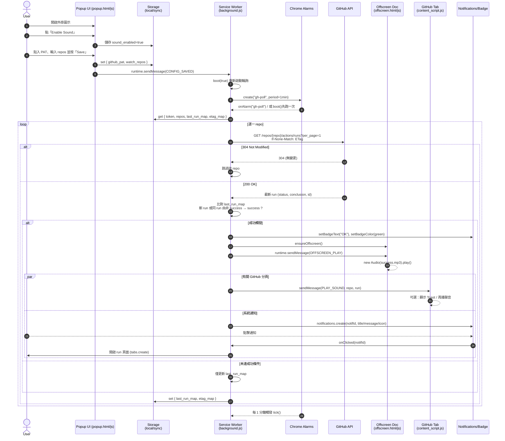

# GitHub Actions Success Sound 🔔
A Chrome Extension that plays a success sound when your GitHub Actions workflow succeeds.

## 🎯 專案目標
當你推 commit、發 PR、CI 成功時，自動播音效或顯示通知。
這個小工具讓你不用每次都開 GitHub 看 build 狀態。

---
Q1: 為什麼需要 PAT？

因為 GitHub 限制匿名 API 每小時只能 60 次，但有 token 的用戶可以到 5000 次。
👉 所以 PAT 是「身分證 + 通行證」。

Q2: 為什麼 Service Worker 能定時跑？

它註冊了 chrome.alarms.create()，Chrome 會在背景喚醒它執行指定任務。
👉 它不是永遠活著，但會在時間到時自動醒來。

Q3: 為什麼能播聲音？

Service Worker 不能直接 new Audio()，所以用 offscreen document 播。
👉 這是一個看不見的隱藏頁面，專門為播放音效設計。

---

| OSI 層級          | 對應這個專案的角色                             | 範例說明                                         |
| --------------- | ------------------------------------- | -------------------------------------------- |
| **L7 應用層**   | 你的 Chrome Extension / GitHub REST API | 透過 HTTPS 調用 `GET /repos/{repo}/actions/runs` |
| **L6 表示層**   | JSON 格式傳輸                             | GitHub 回傳 JSON → SW 解析成物件                    |
| **L5 會話層**   | PAT 驗證、HTTP Headers                   | Authorization: token xxx                     |
| **L4 傳輸層**   | TCP (HTTPS over TLS)                  | Chrome 與 api.github.com 間建立 TCP 連線           |

---
## 我學到的東西
| 主題             | 學到什麼                                                          |
| -------------- | ------------------------------------------------------------- |
| Chrome MV3 架構  | 了解 Manifest v3 如何用 service worker + offscreen 播音效             |
| GitHub API     | 學會用 PAT + REST API + ETag 省額度查 workflow                       |
| HTTP 機制        | 304 Not Modified 節省流量的技巧                                      |
| Web permission | 如何使用 `chrome.action`, `chrome.alarms`, `chrome.notifications` |
| 資料持久化          | 用 `chrome.storage.local` 儲存使用者設定                              |
| 觀念整合           | 能用 OSI 七層對應應用層網路運作                                            |

---

